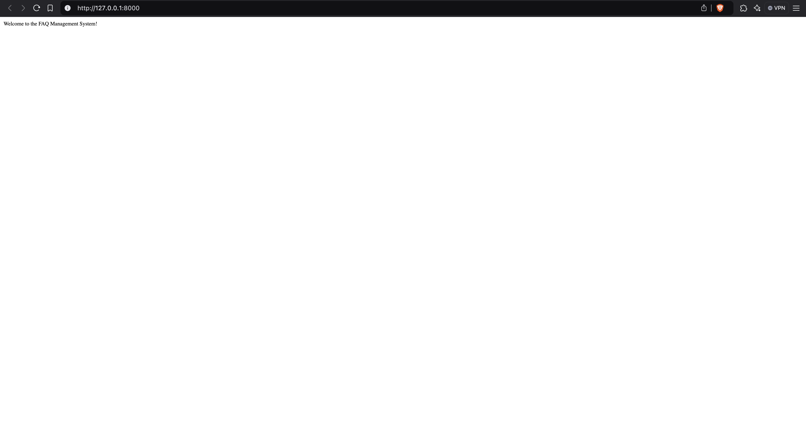
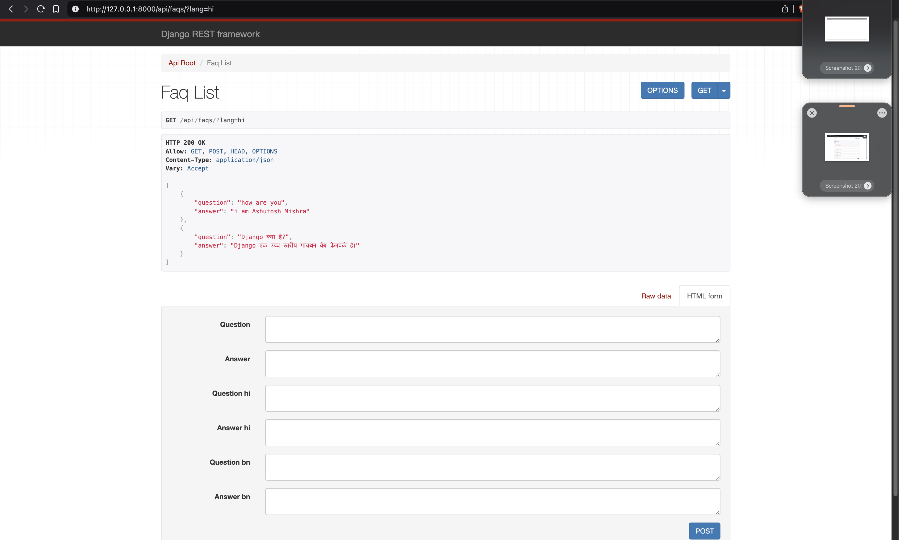
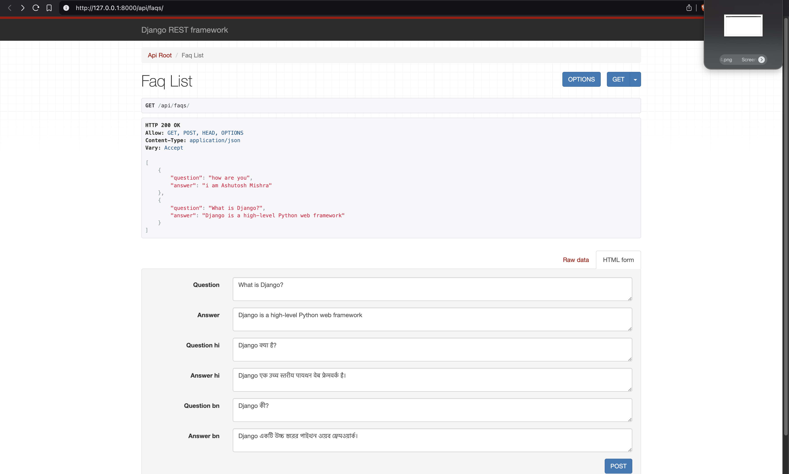

# 📝 FAQ Management API (Django REST Framework)

A simple Django REST framework (DRF) API for managing FAQs with multilingual support.

---

## 📷 Screenshots

1. **LocalHost test**  
   

2. **Hindi URL test**  
   

3. **FAQ Detail View**  
   

---

## 🚀 Features

✅ CRUD operations for FAQs  
✅ Multilingual support: **English (en), Hindi (hi), Bengali (bn)**  
✅ CKEditor for rich-text FAQ answers  
✅ Redis-based caching for performance optimization  

---

## 📦 Installation Steps

1. Clone the repository:
   ```bash
   git clone https://github.com/AshuMishraG/BharatFD_Hiring
   cd BharatFD_Hiring
   ```

2. Build and run the Docker containers:
   ```bash
   docker-compose up --build
   ```

3. Access the application at `http://localhost:8000`.

---

## 📡 API Endpoints

➤ Get All FAQs

GET /api/faqs/

➤ Get FAQs in Hindi

GET /api/faqs/?lang=hi

➤ Create a New FAQ

POST /api/faqs/
{
    "question": "What is Django?",
    "answer": "A Python web framework.",
    "question_hi": "Django क्या है?",
    "answer_hi": "एक पायथन वेब फ्रेमवर्क।"
}

➤ Update an FAQ

PUT /api/faqs/1/
{
    "question": "Updated Question?",
    "answer": "Updated Answer."
}

➤ Delete an FAQ

DELETE /api/faqs/1/

---

## API Usage Examples

- Fetch FAQs in English (default):
  ```bash
  curl http://localhost:8000/api/faqs/
  ```

- Fetch FAQs in Hindi:
  ```bash
  curl http://localhost:8000/api/faqs/?lang=hi
  ```

- Fetch FAQs in Bengali:
  ```bash
  curl http://localhost:8000/api/faqs/?lang=bn
  ```

---

## Contribution Guidelines

- Fork the repository and create a new branch for your feature or bugfix.
- Ensure code quality by running tests and linting.
- Submit a pull request with a detailed description of your changes.

---

## ⚡ Deployment

For Docker Deployment:

docker build -t faq_api .
docker run -p 8000:8000 faq_api

---

## 🛠 Troubleshooting
	•	Redis not running? Start it with:

brew services start redis

	•	Database issues? Reset migrations:

rm -rf faq/migrations
python manage.py makemigrations
python manage.py migrate

---

## 👤 Author: Aashutosh Mishra
## 📧 Email: aashutoshm77@gmail.com